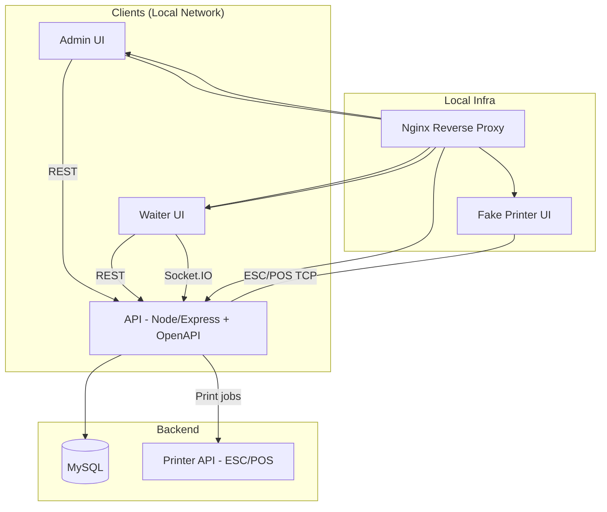
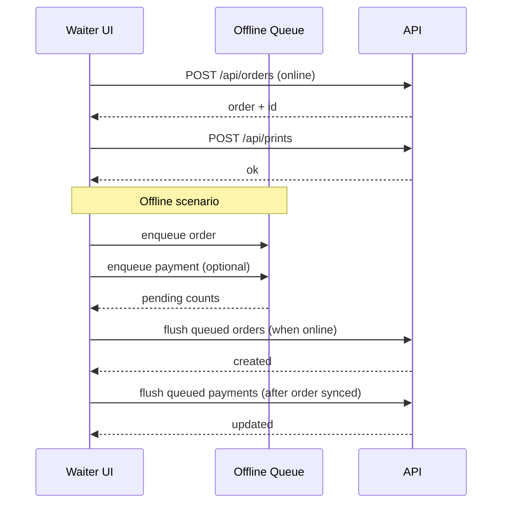

# g.m.b.h. v2

Disclaimer: This project is based on the original idea of g.m.b.h. and its original source code, enhanced and extended with AI.

## Overview

A local-network, web-based order system for small events and venues. The stack is split into:

- API (Node/Express + MySQL)
- Admin UI (React)
- Waiter UI (React)
- Printer API (Go, ESC/POS)
- Fake printer (ESC/POS simulator)
- Nginx + CUPS configs

## Architecture & Decisions

This section captures the current architecture, scope decisions, and cross-cutting behaviors.

### Architecture diagram (Mermaid)



### Offline flow (Waiter)



### System scope

- Single-venue, local-network deployment with offline-capable UIs.
- No receipts/invoices; prints are order “bons” for staff/runners only.
- Default users seeded by migrations (admin/waiter credentials above).

### Event scoping

- All data (orders, items, categories, units, tables, areas, etc.) is scoped to the active event.
- Event selection is handled in Admin; inactive events are read-only.
- Event context is provided via header in API requests; the API uses it internally but does not expose event IDs in OpenAPI schemas.

### API design

- OpenAPI-first: endpoints are defined in `api/openapi/openapi.yaml`.
- Validation is handled by `express-openapi-validator`.
- API is CommonJS (for compatibility); UI projects are ESM.
- Structured logging with request logs only on debug, errors always logged.

### Offline behavior (Waiter)

- Core reference data (items, categories, units, areas, tables) is cached locally per user/event.
- Orders can be created while offline and are queued for sync.
- Payments can be queued offline; payments for unsent orders are queued until the order syncs.
- Pending counts are derived from the offline queues and shown consistently across screens.

### Realtime updates

- Socket events are emitted by the API for major entity changes.
- Clients invalidate queries on socket events and use cache-and-network to avoid duplicates.

### Printing

- Printer API handles ESC/POS printing (80mm layout).
- Fake printer simulates output for local testing.
- Receipt printer support is removed; only order bons are printed.

## Subprojects

- API: `api/README.md`
- Admin UI: `admin/README.md`
- Waiter UI: `waiter/README.md`
- Printer API: `printer-api/README.md`
- Fake printer: `fake-printer/README.md`
- Nginx config: `nginx/README.md`
- CUPS config: `cups/README.md`

## Quickstart (Docker)

Use the Makefile to start the local stack.

- Full stack (api + mysql + nginx + printer-api + fake-printer + dozzle)
  - `make up`
- Mac-friendly stack (api + mysql + nginx + fake-printer + dozzle)
  - `make up-mac`
  - Note: `make up-mac` points the API to `http://host.docker.internal:8761` for the printer API.

Stop containers:

- `docker compose down`

Reset data volumes (destructive):

- `make clean`

## Local dev (without Docker)

Run each service in its folder:

- API: `npm --prefix api install` then `npm --prefix api run dev`
- Admin: `npm --prefix admin install` then `npm --prefix admin run dev`
- Waiter: `npm --prefix waiter install` then `npm --prefix waiter run dev`
- Printer API: `make -C printer-api run`
- Fake printer: `npm --prefix fake-printer install` then `npm --prefix fake-printer run dev`

## Default credentials

- Admin: `admin` / `bierh0len!`
- Waiter: `waiter` / `gehmal25`

## Ports

- API: `http://localhost:8080`
- Admin (dev): `http://localhost:3000/admin/`
- Waiter (dev): `https://localhost:5173`
- Nginx (waiter): `http://localhost` / `https://localhost`
- Nginx (admin): `http://localhost/admin` / `https://localhost/admin`
- Printer API: `http://localhost:8761`
- Fake printer UI: `http://localhost:9101`
- Fake printer TCP: `localhost:9100`
- Dozzle: `http://localhost:9999` (if enabled)

## Testing

- API tests (local MySQL): `make test-api`
- API tests (Docker): `make test-api-docker`
  - This uses `docker compose -f docker-compose.yml -f docker-compose.test.yml` under the hood, so `docker-compose.test.yml` is an override file and must always be combined with `docker-compose.yml` (it does not define images/builds on its own).

## Docker Compose structure

- `docker-compose.yml` defines the full stack with build contexts so a plain `docker compose up` builds and runs all services (API, admin, waiter, nginx, printers, and utilities).
- `docker-compose.dev.yml` only overrides the API command and mounts MySQL init scripts, while nginx proxies to the host dev servers for admin/waiter. Use `make up-dev`/`make up-dev-d` and run `npm --prefix admin run dev` + `npm --prefix waiter run dev` locally.
- The chaos/test targets explicitly layer their overrides on top of `docker-compose.yml` to avoid pulling in the dev overrides.
- Production stays isolated in `prod/` with its own `docker-compose.yml` and Makefile, so you can copy `prod/` to a server and run `make up` there without the rest of the repo.

## Production

- Build the UIs before packaging: run `npm --prefix waiter run build` and `npm --prefix admin run build` so the generated `dist` folders exist for the production bundle.
- Copy the `prod/` folder together with the built `admin/dist` and `waiter/dist` into a production host. Inside `prod/` run `make up` (or `./Makefile` targets) to use the standalone compose stack that already wires nginx, certs, fake printer, Dozzle, update API, etc.
- The `prod/` compose mounts the baked UI assets (`../admin/dist`, `../waiter/dist`), uses pinned Docker images, and brings up nginx with the same configuration as the dev proxy but pointing to the production services.
- Single-image transfer (example: API):
  ```sh
  IMAGE=gmbh-api CONTEXT=api TAG=latest REMOTE=gmbh@192.168.100.100 make transfer-image
  ```
  On the target host:
  ```sh
  docker load -i /tmp/gmbh-api_latest.tar
  docker tag gmbh-api:latest gmbh-api:latest
  ```

## Makefile targets

- `make up-dev`, `make up-dev-d`: API + infra with nginx proxying to host-run admin/waiter dev servers
- `make up-dev-mac`, `make up-dev-mac-d`: Mac-friendly variant of the dev stack
- `make chaos-api`: chaos test suite
- `make test-api`, `make test-api-docker`: API tests
- `make clean`: remove docker volumes
