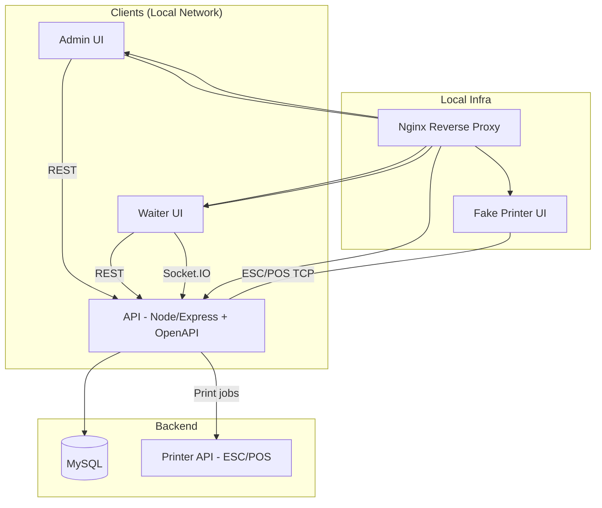
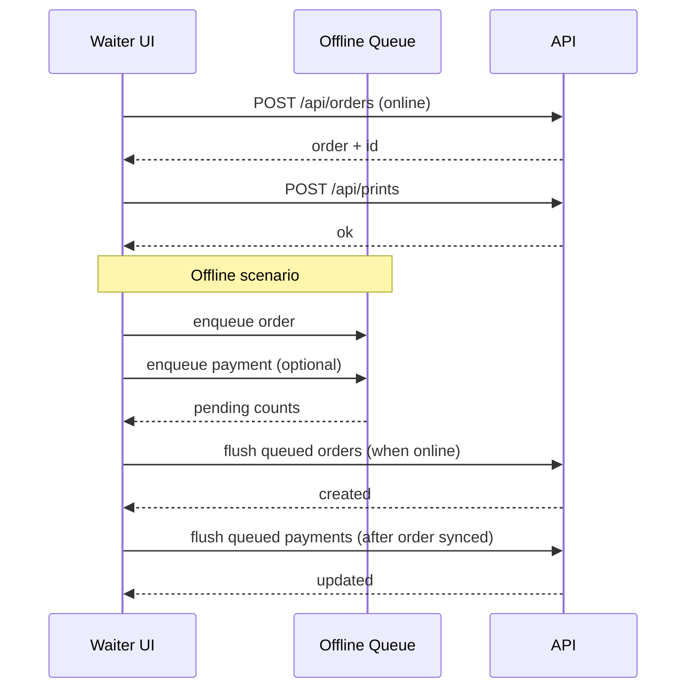

# g.m.b.h. v2

Disclaimer: This project is based on the original idea of g.m.b.h. and its original source code, enhanced and extended with AI.

## Overview

A local-network, web-based order system for small events and venues. The stack is split into:

- API (Node/Express + MySQL)
- Admin UI (React)
- Waiter UI (React)
- Printer API (Go, ESC/POS)
- Fake printer (ESC/POS simulator)
- Nginx + CUPS configs

## Architecture & Decisions

This section captures the current architecture, scope decisions, and cross-cutting behaviors.

### Architecture diagram (Mermaid)

### Offline flow (Waiter)

### System scope

- Single-venue, local-network deployment with offline-capable UIs.
- No receipts/invoices; prints are order “bons” for staff/runners only.
- Default users seeded by migrations (admin/waiter credentials above).

### Event scoping

- All data (orders, items, categories, units, tables, areas, etc.) is scoped to the active event.
- Event selection is handled in Admin; inactive events are read-only.
- Event context is provided via header in API requests; the API uses it internally but does not expose event IDs in OpenAPI schemas.

### API design

- OpenAPI-first: endpoints are defined in `api/openapi/openapi.yaml`.
- Validation is handled by `express-openapi-validator`.
- API is CommonJS (for compatibility); UI projects are ESM.
- Structured logging with request logs only on debug, errors always logged.

### Offline behavior (Waiter)

- Core reference data (items, categories, units, areas, tables) is cached locally per user/event.
- Orders can be created while offline and are queued for sync.
- Payments can be queued offline; payments for unsent orders are queued until the order syncs.
- Pending counts are derived from the offline queues and shown consistently across screens.

### Realtime updates

- Socket events are emitted by the API for major entity changes.
- Clients invalidate queries on socket events and use cache-and-network to avoid duplicates.

### Printing

- Printer API handles ESC/POS printing (80mm layout).
- Fake printer simulates output for local testing.
- Receipt printer support is removed; only order bons are printed.

## Subprojects

- API: `api/README.md`
- Admin UI: `admin/README.md`
- Waiter UI: `waiter/README.md`
- Printer API: `printer-api/README.md`
- Fake printer: `fake-printer/README.md`
- Nginx config: `nginx/README.md`
- CUPS config: `cups/README.md`

## Quickstart (Docker)

Use the Makefile to start the local stack.

- Full stack (api + mysql + nginx + printer-api + fake-printer + dozzle)
  - `make up`
- Mac-friendly stack (api + mysql + nginx + fake-printer + dozzle)
  - `make up-mac`
  - Note: `make up-mac` points the API to `http://host.docker.internal:8761` for the printer API.

Stop containers:

- `docker compose down`

Reset data volumes (destructive):

- `make clean`

## Local dev (without Docker)

Run each service in its folder:

- API: `npm --prefix api install` then `npm --prefix api run dev`
- Admin: `npm --prefix admin install` then `npm --prefix admin run dev`
- Waiter: `npm --prefix waiter install` then `npm --prefix waiter run dev`
- Printer API: `make -C printer-api run`
- Fake printer: `npm --prefix fake-printer install` then `npm --prefix fake-printer run dev`

## Default credentials

- Admin: `admin` / `bierh0len!`
- Waiter: `waiter` / `gehmal25`

## Ports

- API: `http://localhost:8080`
- Admin (dev): `http://localhost:3000`
- Waiter (dev): `https://localhost:5173`
- Nginx (waiter): `http://localhost` / `https://localhost`
- Nginx (admin): `http://localhost/admin` / `https://localhost/admin`
- Printer API: `http://localhost:8761`
- Fake printer UI: `http://localhost:9101`
- Fake printer TCP: `localhost:9100`
- Dozzle: `http://localhost:9999` (if enabled)

## Testing

- API tests (local MySQL): `make test-api`
- API tests (Docker): `make test-api-docker`

## Production

- Build Waiter UI: `npm --prefix waiter run build`
- Start production stack: `make up-prod`

The production compose mounts `waiter/dist` into Nginx.

## Makefile targets

- `make up`, `make up-d`: full stack
- `make up-mac`, `make up-mac-d`: Mac-friendly stack
- `make up-prod`: production compose
- `make test-api`, `make test-api-docker`: API tests
- `make clean`: remove docker volumes

## Release management

- **Version metadata**: each subproject carries its own version (`api/package.json`, `admin/package.json`, `waiter/package.json`, `fake-printer/package.json`, `printer-api/version/version.go`). Increment the relevant version before releasing.
- **Publish images manually**: run `RELEASE_TAG=dev-1.2.3 make release-images` (default `RELEASE_TAG=latest`) to build & push Docker images for API, printer API, fake printer, and the nginx reverse proxy. The helper scripts read the version metadata and tag each image accordingly while also applying the chosen release tag.
- **Environment variables**: override `RELEASE_REGISTRY` and `RELEASE_REPO` if you publish to a non-default registry (defaults to `docker.io/gmbh`). The release target relies on `docker` CLI being logged in before pushing.

## Automated releases (GitHub Actions)

- The `.github/workflows/release.yml` workflow runs on every push to `main` and can be triggered manually via “Run workflow”. It builds and pushes the Docker images using the same `make release-images` target so both automated and manual releases share the same logic.
- The workflow exposes an optional `release_tag` input (default `latest`) that appends an extra tag on top of each service’s version tag.
- Provide `DOCKERHUB_USERNAME` and `DOCKERHUB_TOKEN` as repository secrets so the workflow can authenticate with Docker Hub.
